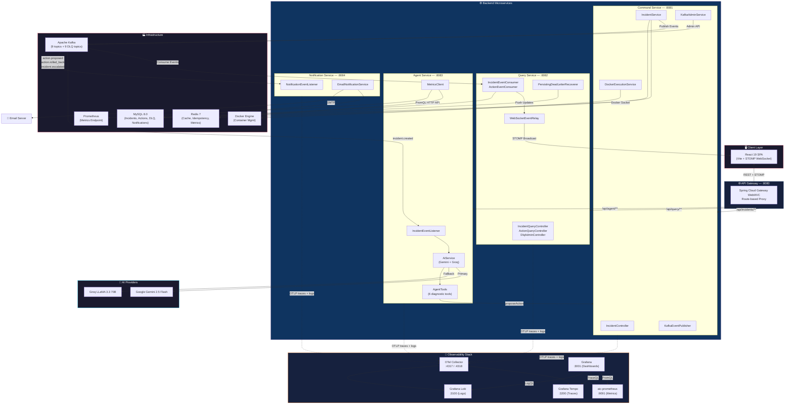
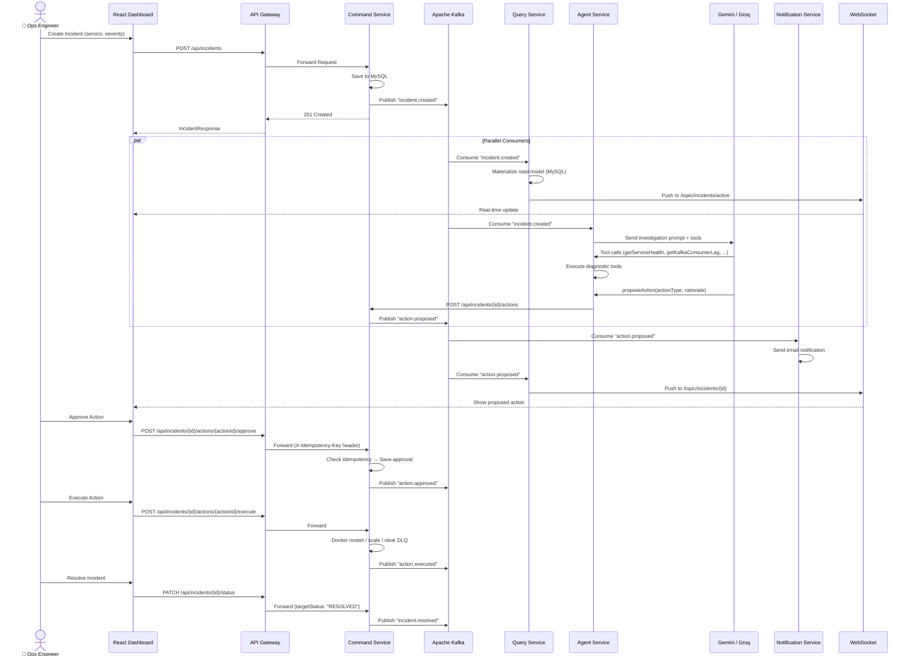
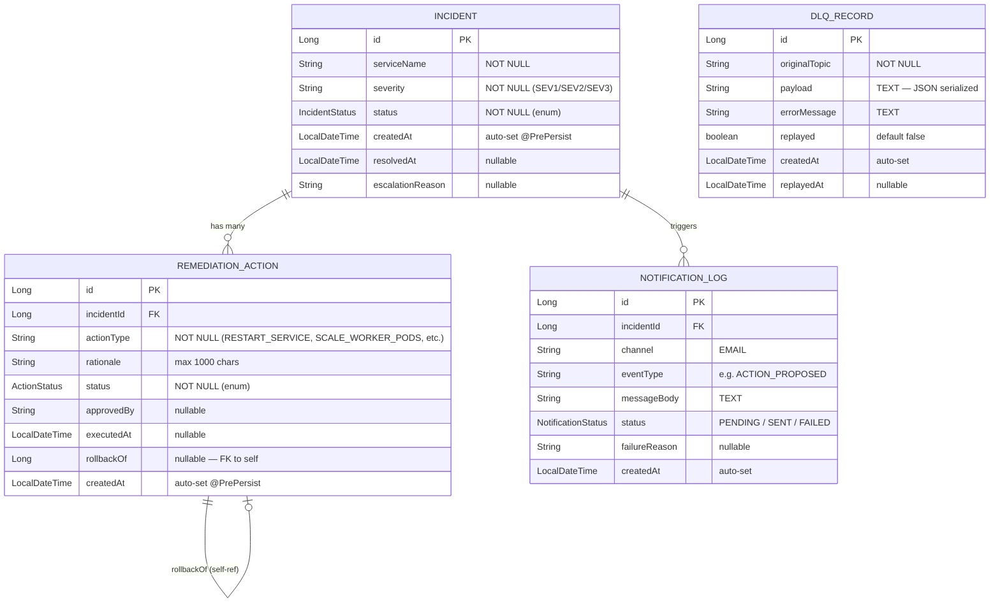
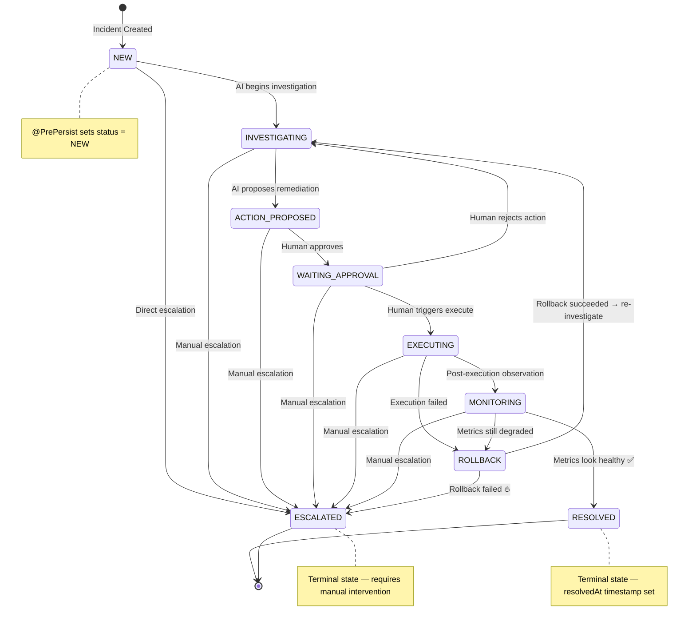
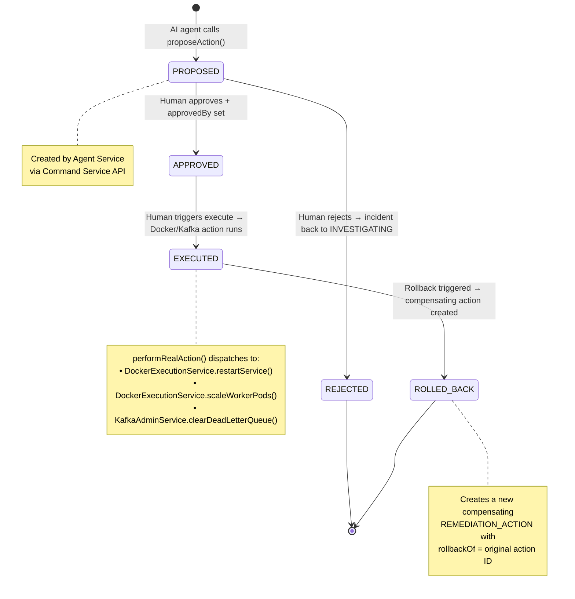
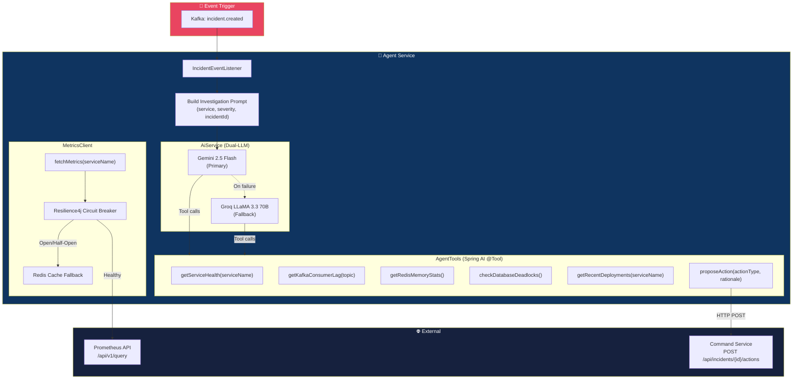
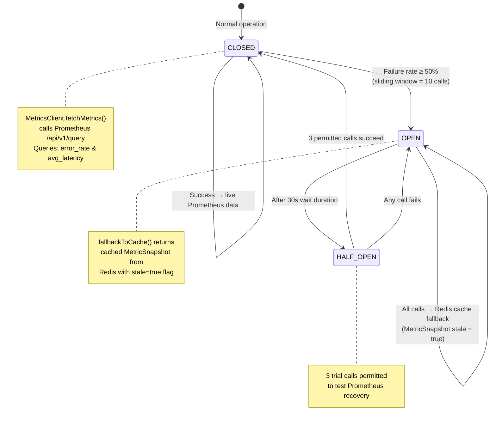
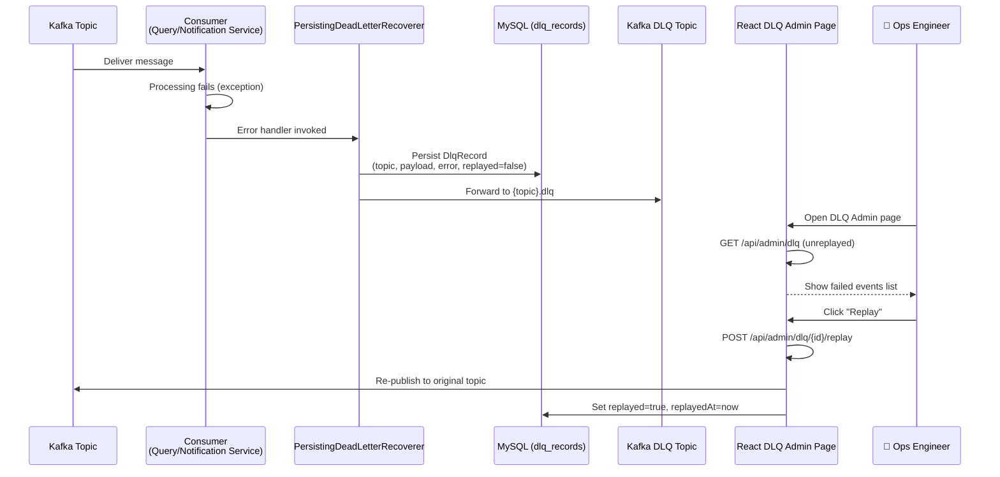

<div align="center">

# 🛡️ AI Incident Commander

### Autonomous AI-Powered Incident Management Platform

[](https://openjdk.org/projects/jdk/21/)
[](https://spring.io/projects/spring-boot)
[](https://react.dev/)
[](https://kafka.apache.org/)
[](https://docs.docker.com/compose/)
[](https://ai.google.dev/)
[](https://grafana.com/)
[](https://opentelemetry.io/)
[](https://opensource.org/licenses/MIT)

> **An event-driven, CQRS-based platform where AI agents autonomously investigate production incidents, diagnose root causes via live telemetry, and propose remediations — all with human-in-the-loop approval before any action executes.**

[Features](#-key-features) · [Architecture](#-high-level-design-hld) · [Low-Level Design](#-low-level-design-lld) · [Getting Started](#-getting-started) · [API Reference](#-api-reference) · [Tech Stack](#%EF%B8%8F-tech-stack)

</div>

---

## 📋 Table of Contents

- [Key Features](#-key-features)
- [High-Level Design (HLD)](#-high-level-design-hld)
  - [System Architecture Diagram](#system-architecture-overview)
  - [Event-Driven Flow](#event-driven-flow)
  - [CQRS Pattern](#cqrs-pattern)
- [Low-Level Design (LLD)](#-low-level-design-lld)
  - [Domain Models & ER Diagram](#domain-models--er-diagram)
  - [Incident Lifecycle State Machine](#incident-lifecycle-state-machine)
  - [Action Lifecycle State Machine](#action-lifecycle-state-machine)
  - [Kafka Topic Architecture](#kafka-topic-architecture)
  - [AI Agent Reasoning Pipeline](#ai-agent-reasoning-pipeline)
  - [Circuit Breaker & Resilience](#circuit-breaker--resilience-pattern)
  - [Dead Letter Queue (DLQ) Pipeline](#dead-letter-queue-dlq-pipeline)
- [Service Breakdown](#-service-breakdown)
- [Getting Started](#-getting-started)
- [API Reference](#-api-reference)
- [Frontend Pages](#-frontend-pages)
- [Tech Stack](#%EF%B8%8F-tech-stack)

---

## ✨ Key Features

| Feature | Description |
|:---|:---|
| 🤖 **Autonomous AI Investigation** | Gemini 2.5 Flash + Groq LLaMA 3.3 agents automatically investigate incidents using diagnostic tools |
| 🔄 **CQRS Architecture** | Strict command/query separation with Kafka event sourcing for scalability and auditability |
| ✅ **Human-in-the-Loop** | AI proposes actions; humans approve/reject before execution. No autonomous execution. |
| 🐳 **Docker Execution Engine** | Approved actions (restart, scale) execute against real Docker containers via Docker socket |
| 📊 **Live Prometheus Telemetry** | Real-time error rate & latency metrics with Resilience4j circuit breaker fallback to Redis cache |
| 📧 **Email Notifications** | Automated alerts for proposed actions, rollbacks, and escalations via SMTP |
| 🔌 **Real-Time WebSocket** | STOMP over WebSocket pushes live incident updates to the React dashboard |
| 💀 **Dead Letter Queue Admin** | Failed Kafka events are persisted to MySQL and can be inspected/replayed from the UI |
| 🛡️ **Idempotency Protection** | Redis-backed idempotency keys prevent duplicate approve/execute operations |
| 🔁 **Rollback & Escalation** | Failed remediations auto-generate compensating rollback actions; unresolvable incidents escalate |
| 📡 **Full Observability Stack** | OpenTelemetry Collector ships traces/logs from every service to Tempo + Loki; Grafana dashboards unify metrics, traces, and logs |
| 🔗 **Cross-Project Scaling** | `SCALE_WORKER_PODS` reads Docker Compose labels off the target container to scale services in *other* Compose projects (e.g. [Distributed Job Forge](../distributed-job-forge)) via a host-path mapping config |

---

## 🏗️ High-Level Design (HLD)

### System Architecture Overview



---

### Event-Driven Flow

> How an incident flows through the entire system — from creation to resolution.



---

### CQRS Pattern


---

## 📐 Low-Level Design (LLD)

### Domain Models & ER Diagram



---

### Incident Lifecycle State Machine



---

### Action Lifecycle State Machine



---

### Kafka Topic Architecture

```mermaid
graph TB
    subgraph Publishers["📤 Publishers"]
        CMD["Command Service"]
    end

    subgraph Topics["📨 Kafka Topics (3 partitions each)"]
        T1["incident.created"]
        T2["action.proposed"]
        T3["action.approved"]
        T4["action.executed"]
        T5["action.rolled_back"]
        T6["action.rejected"]
        T7["incident.escalated"]
        T8["incident.resolved"]
        T9["incident.status_updated"]
    end

    subgraph DLQTopics["💀 Dead Letter Queues"]
        D1["incident.created.dlq"]
        D2["action.proposed.dlq"]
        D3["action.approved.dlq"]
        D4["action.executed.dlq"]
        D5["action.rolled_back.dlq"]
        D6["action.rejected.dlq"]
        D7["incident.escalated.dlq"]
        D8["incident.resolved.dlq"]
        D9["incident.status_updated.dlq"]
    end

    subgraph Consumers["📥 Consumer Groups"]
        QS["query-service-group<br/>(Query Service)"]
        AGT["agent-service-group<br/>(Agent Service)"]
        NTF["notification-service-group<br/>(Notification Service)"]
    end

    CMD --> T1 & T2 & T3 & T4 & T5 & T6 & T7 & T8 & T9

    T1 --> QS & AGT
    T2 --> QS & NTF
    T3 --> QS
    T4 --> QS
    T5 --> QS & NTF
    T6 --> QS
    T7 --> QS & NTF
    T8 --> QS
    T9 --> QS

    T1 -.->|On failure| D1
    T2 -.->|On failure| D2
    T3 -.->|On failure| D3
    T4 -.->|On failure| D4
    T5 -.->|On failure| D5
    T6 -.->|On failure| D6
    T7 -.->|On failure| D7
    T8 -.->|On failure| D8
    T9 -.->|On failure| D9

    style Publishers fill:#0f3460,color:#fff
    style Topics fill:#533483,color:#fff
    style DLQTopics fill:#8B0000,color:#fff
    style Consumers fill:#16213e,color:#fff
```



---

### AI Agent Reasoning Pipeline



---

### Circuit Breaker & Resilience Pattern



---

### Dead Letter Queue (DLQ) Pipeline



---

## 🔧 Service Breakdown

### Command Service (`:8081`) — Write Side

The **single source of truth** for all state mutations. Every write operation publishes a Kafka event.

| Endpoint | Method | Description |
|:---|:---:|:---|
| `/api/incidents` | `POST` | Create a new incident |
| `/api/incidents/{id}` | `GET` | Get incident by ID |
| `/api/incidents/{id}/status` | `PATCH` | Update status (escalate / resolve) |
| `/api/incidents/{id}/actions` | `POST` | Propose a remediation action |
| `/api/incidents/{id}/actions/{actionId}/approve` | `POST` | Approve a proposed action (idempotent) |
| `/api/incidents/{id}/actions/{actionId}/reject` | `POST` | Reject a proposed action |
| `/api/incidents/{id}/actions/{actionId}/execute` | `POST` | Execute an approved action (idempotent) |
| `/api/incidents/{id}/actions/{actionId}/rollback` | `POST` | Rollback an executed action |

**Execution Engine** — When an action is executed, it dispatches to real infrastructure:

| Action Type | Handler | What It Does |
|:---|:---|:---|
| `RESTART_SERVICE` | `DockerExecutionService` | Restarts Docker container via Docker socket |
| `SCALE_WORKER_PODS` | `DockerExecutionService` | Reads the target container's `com.docker.compose.project/service/working_dir` labels, resolves the correct (possibly cross-project) Compose file via `scaling.path-mappings`, and runs `docker compose -p <project> --scale {service}=N` |
| `CLEAR_DEAD_LETTER_QUEUE` | `KafkaAdminService` | Deletes all records from a Kafka DLQ topic (checks topic existence first to avoid spurious errors) |

> `SCALE_WORKER_PODS` isn't limited to this project's own containers — it can scale services in a **different** Compose project (e.g. Distributed Job Forge) as long as that project's directory is mounted read-only and mapped via `scaling.path-mappings` in `command-service`'s `application.yml`.

---

### Query Service (`:8082`) — Read Side

Consumes Kafka events and materializes **read-optimized projections** in its own MySQL tables. Also hosts WebSocket + DLQ admin.

| Endpoint | Method | Description |
|:---|:---:|:---|
| `/api/query/incidents` | `GET` | List all incidents |
| `/api/query/incidents/active` | `GET` | List active (non-resolved/escalated) incidents |
| `/api/query/incidents/{id}` | `GET` | Get incident by ID |
| `/api/query/incidents/{id}/detail` | `GET` | Get full incident detail with actions |
| `/api/query/incidents/status/{status}` | `GET` | Filter by status |
| `/api/query/incidents/severity/{severity}` | `GET` | Filter by severity |
| `/api/query/incidents/service/{name}` | `GET` | Filter by service name |
| `/api/query/incidents/{id}/actions` | `GET` | List actions for incident |
| `/api/admin/dlq` | `GET` | List unreplayed DLQ records |
| `/api/admin/dlq/all` | `GET` | List all DLQ records |
| `/api/admin/dlq/{id}/replay` | `POST` | Replay a failed event |

**WebSocket Destinations:**

| STOMP Destination | Trigger |
|:---|:---|
| `/topic/incidents/{id}` | Any update to a specific incident |
| `/topic/incidents/active` | Active incident list changes |

---

### Agent Service (`:8083`) — AI Brain

Listens for `incident.created` events and autonomously investigates using LLM-powered tool calling.

**AI Tools (Spring AI `@Tool`):**

| Tool | Description |
|:---|:---|
| `getServiceHealth(serviceName)` | Returns `HEALTHY` / `DEGRADED` / `UNHEALTHY` |
| `getKafkaConsumerLag(topic)` | Returns current consumer lag count |
| `getRedisMemoryStats()` | Returns `usedMemoryMb` and `evictedKeys` |
| `checkDatabaseDeadlocks()` | Returns recent deadlock count from MySQL |
| `getRecentDeployments(serviceName)` | Returns latest deployment info for correlation |
| `proposeAction(actionType, rationale)` | **Terminal tool** — proposes remediation via Command Service |

**MetricsClient (Prometheus Integration):**

| PromQL Query | Metric |
|:---|:---|
| `sum(rate(http_requests_total{job="{svc}",status=~"5.."}[5m])) / sum(rate(http_requests_total{job="{svc}"}[5m])) * 100` | Error Rate (%) |
| `sum(rate(http_request_duration_seconds_sum{job="{svc}"}[5m])) / sum(rate(http_request_duration_seconds_count{job="{svc}"}[5m]))` | Avg Latency (seconds → ms) |

---

### Notification Service (`:8084`) — Alerting

Consumes specific Kafka topics and sends email alerts asynchronously.

| Kafka Topic | Email Subject Pattern |
|:---|:---|
| `action.proposed` | 🚨 Incident Created \| #ID |
| `action.rolled_back` | ↩ Action Rolled Back \| Incident #ID |
| `incident.escalated` | 🔥 Incident Escalated \| Incident #ID |

---

### API Gateway (`:8080`) — Entry Point

Spring Cloud Gateway WebMVC with route-based proxying:

| Route Pattern | Target |
|:---|:---|
| `/api/incidents/**` | Command Service `:8081` |
| `/api/query/**` | Query Service `:8082` |
| `/api/agent/**` | Agent Service `:8083` |

---

## 🚀 Getting Started

### Prerequisites

- **Java 21** (JDK) — only needed if building services outside Docker
- **Docker & Docker Compose**
- **Node.js 18+** — only needed for frontend hot-reload dev mode
- **Prometheus** (optional external instance) — the platform monitors your *own* microservices' metrics; if you don't have one, the bundled `aic-prometheus` container works standalone

### 1. Clone & Configure

```bash
git clone https://github.com/your-username/AI-Incident-Commander.git
cd AI-Incident-Commander
```

Copy the environment template and fill in your values:

```bash
cp .env.example .env
```

Key environment variables:

```env
# Database (MySQL)
DB_USERNAME=root
DB_PASSWORD=change_this_password
MYSQL_ROOT_PASSWORD=change_this_password
MYSQL_DATABASE=incident_commander
MYSQL_PORT=3308

# Redis / Kafka
REDIS_PORT=6380
KAFKA_PORT=9094

# AI API Keys (required)
GEMINI_API_KEY=your_gemini_api_key
GROQ_API_KEY=your_groq_api_key

# Email Notifications (required for alerts)
MAIL_USERNAME=your_email@gmail.com
MAIL_PASSWORD=your_app_password
ALERT_EMAIL=recipient@example.com

# Telemetry target — services this platform monitors/investigates
PROMETHEUS_URL=http://host.docker.internal:9090
MONITORED_SERVICES=order-service,payment-service
ANOMALY_LATENCY_THRESHOLD_MS=500

# Docker execution engine
DOCKER_HOST=tcp://localhost:2375
DOCKER_COMPOSE_DIR=C:/AI Incident Commander

# Optional — enables SCALE_WORKER_PODS against another Compose project
# (host path -> the read-only mount `command-service` exposes it under)
DJF_PROJECT_DIR=C:/DistributedJobForge
```

> The `docker-compose.yml` `scaling.path-mappings` config (in `command-service`'s `application.yml`) maps that host path to `/djf-workspace` inside the container, so `SCALE_WORKER_PODS` can target a sibling project's Compose file directly.

### 2. Start Everything

```bash
docker compose up --build -d
```

This single command builds and starts **all 5 backend services, the frontend, and the full observability stack** — 15 containers total: MySQL, Redis, Zookeeper, Kafka, the 5 Spring Boot services, the React frontend (served via Nginx), OTel Collector, Tempo, Loki, `aic-prometheus`, and Grafana.

**Application services:**

| Service | Host Port → Container | Health Check |
|:---|:---:|:---|
| Frontend (Nginx) | `5174` → `80` | `http://localhost:5174` |
| API Gateway | `18080` → `8080` | `http://localhost:18080/actuator/health` |
| Command Service | `18081` → `8081` | `http://localhost:18081/actuator/health` |
| Query Service | `18082` → `8082` | `http://localhost:18082/actuator/health` |
| Agent Service | `18083` → `8083` | `http://localhost:18083/actuator/health` |
| Notification Service | `18084` → `8084` | `http://localhost:18084/actuator/health` |
| MySQL | `${MYSQL_PORT}` → `3306` | — |
| Redis | `${REDIS_PORT}` → `6379` | — |
| Kafka | `${KAFKA_PORT}` → `9092` | — |

**Observability stack:**

| Service | Port | Purpose |
|:---|:---:|:---|
| Grafana | `3001` | Unified dashboards (metrics + traces + logs); anonymous admin access enabled for local dev |
| aic-prometheus | `9091` | Scrapes `/actuator/prometheus` from all 5 services; remote-write + exemplar storage enabled |
| Tempo | `3200` | Distributed trace storage (100% sampling from every service) |
| Loki | `3100` | Centralized log aggregation |
| OTel Collector | `4317` / `4318` | OTLP gRPC / HTTP ingestion from all services, forwarding to Tempo + Loki |

Open **http://localhost:5174** for the dashboard, or **http://localhost:3001** for Grafana.

### 3. (Optional) Frontend Dev Mode

For hot-reload during frontend development, run it outside Docker instead:

```bash
cd Frontend
npm install
npm run dev
```

Open **http://localhost:5173** in your browser (point `Frontend/.env`'s API base URL at `http://localhost:18080`).

---

## 📡 API Reference

> Examples below target the Docker Compose gateway port (`18080`). If you're running `api-gateway` standalone (outside Docker), use `8080` instead.

### Create an Incident

```bash
curl -X POST http://localhost:18080/api/incidents \
  -H "Content-Type: application/json" \
  -d '{
    "serviceName": "order-service",
    "severity": "SEV1"
  }'
```

### Approve an Action (Idempotent)

```bash
curl -X POST http://localhost:18080/api/incidents/1/actions/1/approve \
  -H "Content-Type: application/json" \
  -H "X-Idempotency-Key: $(uuidgen)" \
  -d '{"approvedBy": "ops-engineer-1"}'
```

### Execute an Action

```bash
curl -X POST http://localhost:18080/api/incidents/1/actions/1/execute \
  -H "X-Idempotency-Key: $(uuidgen)"
```

### Escalate an Incident

```bash
curl -X PATCH http://localhost:18080/api/incidents/1/status \
  -H "Content-Type: application/json" \
  -d '{
    "targetStatus": "ESCALATED",
    "reason": "Multiple rollback attempts failed"
  }'
```

### Replay a DLQ Record

```bash
curl -X POST http://localhost:18080/api/admin/dlq/1/replay
```

---

## 🖥️ Frontend Pages

| Page | Route | Description |
|:---|:---|:---|
| **Dashboard** | `/` | Live overview with active incident count, severity breakdown, and real-time WebSocket updates |
| **Incidents** | `/incidents` | Full incident list with status filtering and create-incident modal |
| **Incident Detail** | `/incidents/:id` | Complete incident timeline with action lifecycle controls (approve/reject/execute/rollback/escalate/resolve) |
| **Telemetry** | `/telemetry` | Live Prometheus metrics — error rate, latency, circuit breaker state indicator |
| **DLQ Admin** | `/dlq` | Dead letter queue inspector with replay functionality |

---

## 🛠️ Tech Stack

### Backend

| Technology | Purpose |
|:---|:---|
| **Java 21** | Language runtime |
| **Spring Boot 4.1** | Application framework |
| **Spring AI 2.0** | LLM integration (Gemini + OpenAI-compatible) |
| **Spring Cloud Gateway** | API gateway routing |
| **Apache Kafka 7.6** | Event streaming / CQRS event bus |
| **MySQL 8.0** | Persistent storage (command + query + DLQ + notifications) |
| **Redis 7** | Caching (metrics, idempotency keys) |
| **Resilience4j** | Circuit breaker for Prometheus calls |
| **Docker Java API** | Container management execution |
| **Spring WebSocket (STOMP)** | Real-time push to frontend |
| **JavaMailSender** | SMTP email notifications |

### Frontend

| Technology | Purpose |
|:---|:---|
| **React 19** | UI library |
| **Vite 8** | Build tooling & dev server |
| **React Router 7** | Client-side routing |
| **Axios** | HTTP client |
| **STOMP.js + SockJS** | WebSocket client |
| **Lucide React** | Icon library |

### Infrastructure

| Technology | Purpose |
|:---|:---|
| **Docker Compose** | Multi-container orchestration (15 containers) |
| **Zookeeper** | Kafka coordination |
| **Nginx** | Serves the built frontend in production/Docker mode |

### Observability

| Technology | Purpose |
|:---|:---|
| **OpenTelemetry Collector** | Central OTLP ingestion (gRPC `:4317` / HTTP `:4318`); fans out traces + logs |
| **Grafana Tempo** | Distributed trace backend (100% sampling from every Spring Boot service) |
| **Grafana Loki** | Log aggregation backend |
| **Prometheus** (`aic-prometheus`) | Scrapes `/actuator/prometheus` from all 5 services; remote-write + exemplar storage |
| **Grafana** | Unified dashboards correlating metrics, traces, and logs; provisioned via `grafana/provisioning/` |

---

## 📁 Project Structure

```
AI-Incident-Commander/
├── .env                              # Environment configuration
├── docker-compose.yml                # Full stack orchestration (15 containers)
├── otel-collector-config.yml         # OTLP receiver -> Tempo/Loki exporters
├── tempo.yml                         # Grafana Tempo trace backend config
├── loki-config.yml                   # Grafana Loki log backend config
├── aic-prometheus.yml                # Prometheus scrape config (all 5 services)
├── alerts.yml                        # Prometheus alerting rules
├── grafana/provisioning/             # Auto-provisioned datasources + dashboards
│
├── Backend/
│   ├── api-gateway/                  # Spring Cloud Gateway (:8080)
│   ├── command-service/              # CQRS Write Side (:8081)
│   │   ├── controller/               #   REST endpoints
│   │   ├── model/                    #   JPA entities (Incident, RemediationAction)
│   │   ├── service/                  #   Business logic + Docker + Kafka admin
│   │   ├── event/                    #   Kafka event publisher
│   │   └── config/                   #   Kafka topics, Docker, Redis
│   ├── query-service/                # CQRS Read Side (:8082)
│   │   ├── controller/               #   Query endpoints + DLQ admin
│   │   ├── event/                    #   Kafka consumers (incident + action)
│   │   ├── websocket/                #   STOMP WebSocket relay
│   │   └── config/                   #   DLQ recoverer, error handling
│   ├── agent-service/                # AI Brain (:8083)
│   │   ├── service/                  #   AiService (dual-LLM) + AgentTools
│   │   ├── client/                   #   MetricsClient + CommandServiceClient
│   │   ├── event/                    #   Kafka listener (incident.created)
│   │   └── config/                   #   Prometheus, Redis, AI configs
│   └── notification-service/         # Email Alerts (:8084)
│       ├── event/                    #   Kafka listeners
│       └── service/                  #   EmailNotificationService
│
└── Frontend/
    ├── Dockerfile                    # Multi-stage build -> Nginx (served at :5174 in Docker)
    ├── nginx.conf                    # SPA routing + API proxy config
    └── src/
        ├── api/                      # Axios API client
        ├── components/               # Sidebar, CreateIncidentModal, StatusBadge
        ├── hooks/                    # useWebSocket (STOMP)
        ├── pages/                    # Dashboard, Incidents, Detail, Telemetry, DLQ
        └── index.css                 # Design system
```

---

<div align="center">

**Built with ❤️ using Spring AI, Apache Kafka, and React**

*AI Incident Commander — Because production incidents shouldn't wait for humans to wake up.*

</div>
